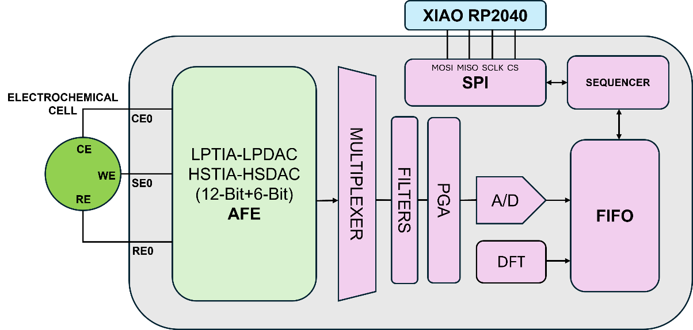
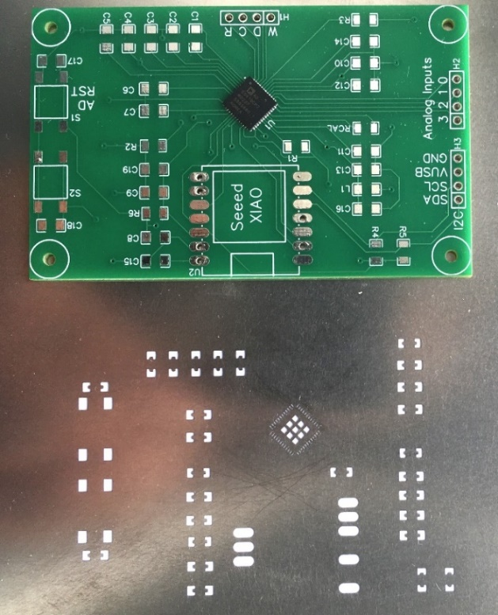
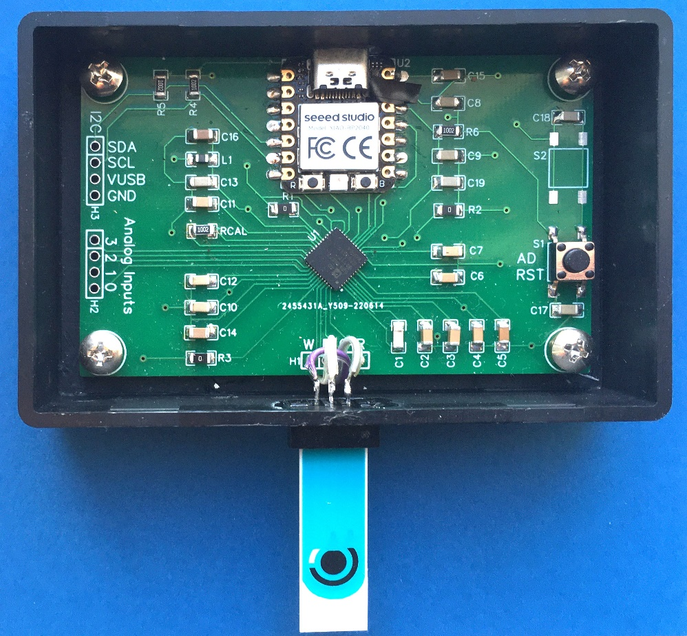
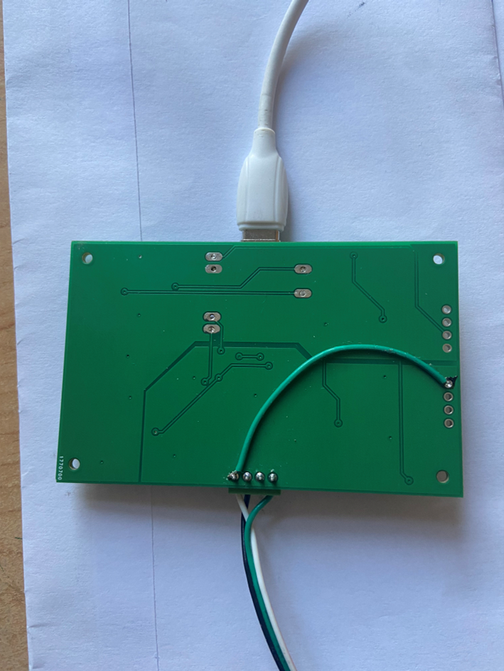
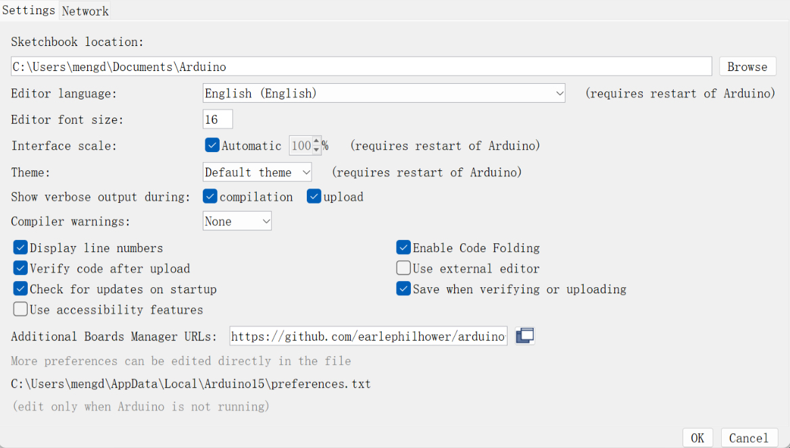
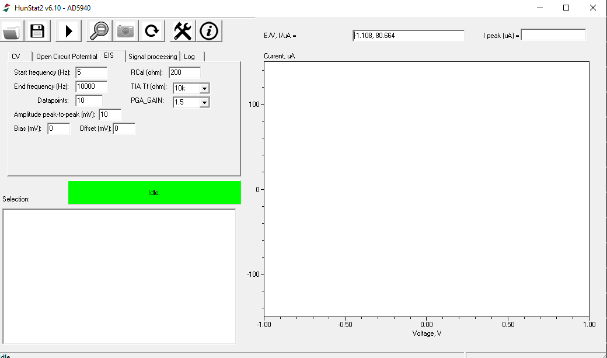
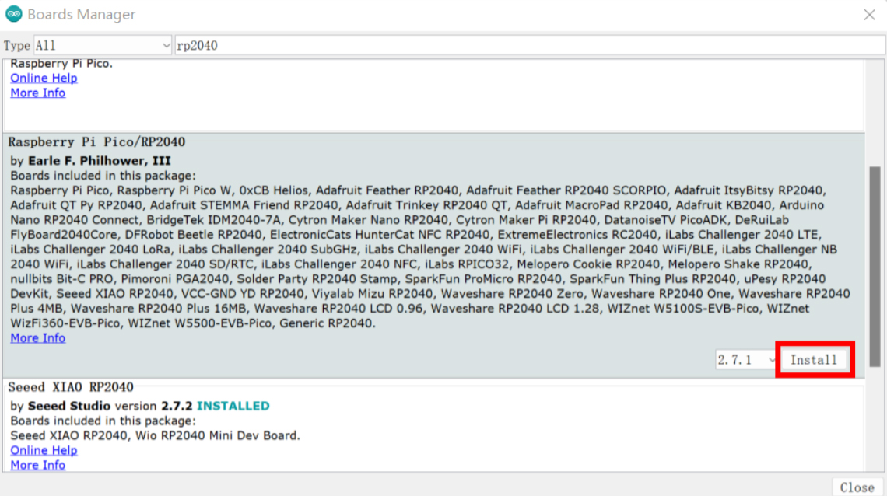
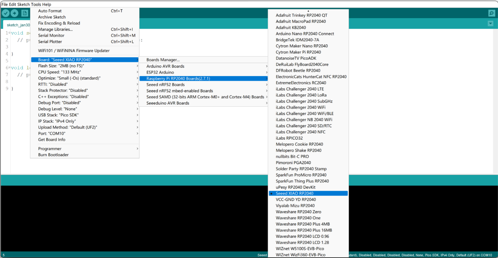
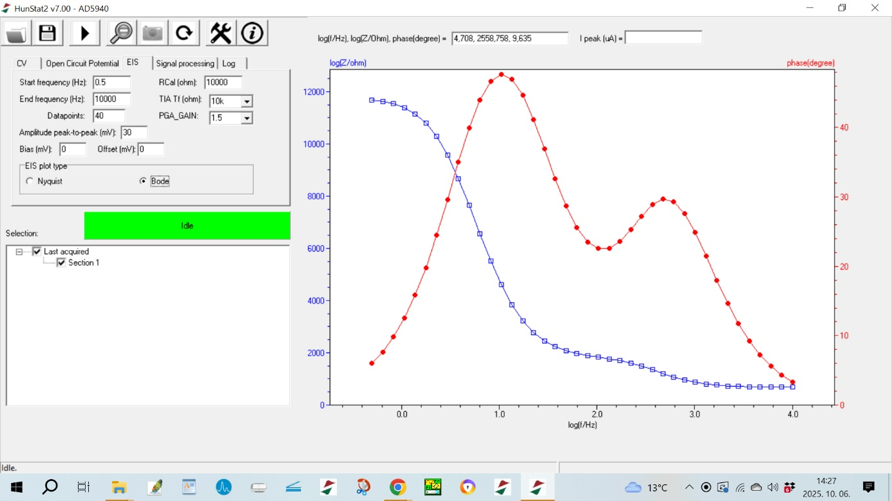
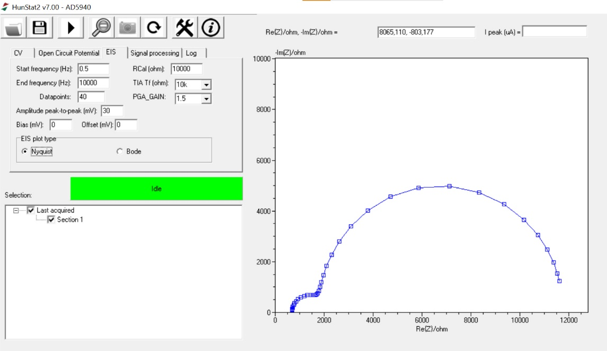

# SUPPORTING INFORMATION

## HunStat2 – a Simple and Low-Cost Potentiostat with Electrochemical Impedance Spectroscopy Capability

**Authors:**  
Istvan Vamosaa, Richard Morrisonb, Sandor Michaletzkyc, Vilmos Kerteszd*  

**Affiliations:**  
a. Lajos Petrik Vocational Chemistry School, Budapest, Hungary  
b. Retired Scientist, Melbourne, Australia  
c. Software developer, Budapest, Hungary  
d. Biosciences Division, Oak Ridge National Laboratory, Oak Ridge, TN, USA  

* **Corresponding Author:**  
Vilmos Kertesz  
Bioanalytical Mass Spectrometry Group  
Biosciences Division  
Oak Ridge National Laboratory, Oak Ridge, TN 37831-6131  
E-mail: [kerteszv@ornl.gov](mailto:kerteszv@ornl.gov)  
Phone: 865-574-3469  

---

This manuscript has been authored by UT-Battelle, LLC, under contract DE-AC05-00OR22725 with the US Department of Energy (DOE).  
The US government retains and the publisher, by accepting the article for publication, acknowledges that the US government retains a nonexclusive, paid-up, irrevocable, worldwide license to publish or reproduce the published form of this manuscript, or allow others to do so, for US government purposes.  
DOE will provide public access to these results of federally sponsored research in accordance with the [DOE Public Access Plan](https://www.energy.gov/downloads/doe-public-access-plan).

---

## S-3 Details on the AD5941 Chip

**Key components of the AD5941 chip :**

Figure S1

- **LPTIA (Low Power Transimpedance Amplifier):** Converts current to voltage.  
- **LPDAC (Low Power Digital-to-Analog Converter):** Generates VZERO and VBIAS.  
- **HSTIA (High-Speed Transimpedance Amplifier):** Converts high-bandwidth current signals up to 200 kHz into voltage for ADC measurement.  
- **HSDAC (High-Speed Digital-to-Analog Converter):** Generates high-frequency sinusoidal excitation signals.  
- **DFT (Discrete Fourier Transform) Engine:** Performs built-in Fourier transformation to compute the real and imaginary components of impedance.  
- **FIFO (First In, First Out) Buffer:** Temporarily stores measurement data to optimize communication with the microcontroller.  
- **SPI (Serial Peripheral Interface):** Provides data communication between the AD5941 and the microcontroller.

The AD5941 AFE includes essential components for voltammetric measurements: control amplifiers, transimpedance amplifiers (LPTIA), and DACs.  
The low-bandwidth AFE supports DC techniques, while the high-bandwidth AFE (capable of handling signals up to 200 kHz) is used for EIS.  
Key components include a high-speed DAC (HSDAC), a frequency generator, and a transimpedance amplifier (HSTIA).

The AD5941’s FIFO buffer temporarily stores measurement data for efficient transfer to a microcontroller, minimizing data loss.  
The chip’s programmable gain amplifier (PGA) adjusts signal levels before digitization.  
The potentiostat control is managed using a XIAO RP2040 microcontroller interfacing with the AD5941 via SPI.  
The XIAO RP2040 manages HunStat2’s operation, serving as the interface between the potentiostat and the PC-based data processing software.  
Communication is handled via USB, ensuring stable data transfer and providing power to the device.

SPI synchronizes data transfer between the microcontroller (Master) and the AD5941 (Slave) using dedicated lines:  
**MOSI** (Master Out, Slave In), **MISO** (Master In, Slave Out), **SCLK** (Clock), and **CS** (Chip Select).

The AD5941 supports amperometry, chronoamperometry, cyclic voltammetry, square wave voltammetry, and EIS.

---

## S-4 Details on the HunStat2 Hardware

The key circuit of the EIS potentiostat is the AD5941 chip.[1]  
The chip is a very small 7×7 mm, 48-pin lead frame chip scale package (LFCSP) integrated circuit.  
Soldering is possible with the help of a stencil ordered together with the printed circuit board (PCB), see Figures **S2a/S2b**.

Figure S2a - PCB layout and stencil of the HunStat2 circuit

Figure S2b - The PCB board with SMD components embedded 

The stencil is a very thin metal plate, on which cutouts are made at the surface-mount device (SMD) pad locations using a laser beam.  
First, tin paste is applied to the solder pads on the PCB through the stencil, then the components are placed on the panel and heated (using a heat gun or a reflow oven).  
The radiated heat melts the tin paste and the components solder in by themselves.

The PCB board can be ordered based on Gerber files accessible from the authors.  
A ready-made mounted circuit board can also be ordered, for which the authors provide the necessary Bill of Materials (BOM) and PCB file.

> **Important:** To measure OCP, the reference electrode must be connected to the AIN3 pin on the board as shown in Figure S3.

Figure S3 - Reference electrode (bottom leftmost connector) must be connected to AIN3 pin (right side) on the board to be able to measure OCP.

To ensure reproducibility and broaden accessibility, the complete device can also be obtained in an assembled form.  
This option is useful where manual assembly may be difficult due to stencil-based soldering or limited SMD experience.  
Gerber, Pick-and-Place, and BOM files are available in the accompanying GitHub repository for professional PCB workflows.

In the schematic (Hardvare/HunStat2 circuit.jpg in this repository), the RCAL value is 10kOhm. In the BOM table, it is 200Ohm. Both are goot, but for general electroanalytical measurements, where the solution resistance is in the order of kOhm, the recommended RCAL value is 3.3kOhm or 4.7 kOhm (1%) resistance.

---

## S-5 Setup Seeeduino XIAO RP2040 in the Arduino IDE
The first step is to add Seeed Studio XIAO RP2040 board package to your Arduino IDE.[2] For this, select the File/Preferences menu in the Arduino IDE, and put 
[https://github.com/earlephilhower/arduino-pico/releases/download/global/package_rp2040_index.json](https://github.com/earlephilhower/arduino-pico/releases/download/global/package_rp2040_index.json) in the Additional Boards Manager URLs field (Figure S4) and click OK.

Figure S4 - Setting up additional boards in the Arduino IDE

In order for the Arduino IDE to handle the Seeeduino XIAO RP2040, navigate to Tools/Board/Boards Manager... menu, type the keyword "RP2040" in the search bar.

> **Important:** Select version 2.7.1. of "Raspberry Pi Pico/RP2040" board and install it (Figure S5). (In our experience, later versions (as of July 1, 2025) don’t work with the board.) After that, select the XIAO RP2040 board from the Tools/Board menu (Figure S6) and the appropriate port. NOTE: Another option is opening 
[https://wiki.seeedstudio.com/XIAO-RP2040-with-Arduino/](https://wiki.seeedstudio.com/XIAO-RP2040-with-Arduino/) and following the instructions. 

The sketch program for the RP2040 can be downloaded from the GitHub [AD5941_25.zip](../Software/AD5941_25.zip) of [3] and upload them to the RP2040. Additional instructions  can be acquired from the authors directly, free of charge.

## S-6 The HunStat2 Graphical User Interface Software. 
The HunStat2 GUI software can be downloaded from the GitHub (HunStat2-v700 (1).exe) of [3] place the files into an empty folder on your computer. After connecting the potentiostat, and launching the GUI, the initial screen will appear .

[Figure S8a](figure-s8a.png), [Figure S8b](figure-s8b.png) shows an example screenshot after an EIS measurement. The icons shown in the top row, from left to right: Open file, Save file, Start measurement, Clear zoom, Save plot (into a PNG file), Redraw current measurement, Settings, Information. The software can handle three electroanalytical techniques: cyclic voltammetry (CV), open circuit potential (OCP), and electrochemical impedance spectroscopy (EIS). Parameters for these techniques can be adjusted in the CV, Open Circuit Potential and EIS tabs. Additionally, the Signal processing tab allows smoothing of the resulting voltammogram in two different ways (Savitzky-Golay or moving average smoothing). Communication between the GUI and the potentiostat can be monitored in the Log tab.

Critical quantitative information can be obtained from the peak heights of recorded CV curves. To do this, you need to draw a baseline. This can be done by holding down the Shift button and clicking the left mouse button. When placing the cursor over the desired peak, the peak height relative to the baseline (Ipeak) can be read in the upper right corner. A more detailed manual can be downloaded from [3] or directly asked from the authors.

Before making a real analytical measurement, it is advisable to perform the a simple checks. 

Connect a given resistor between the shorted CE-RE point and the WE, and run the potential between 0 and 1 V. If the circuit is functioning properly, an increasing current with increasing voltage is observed. Current at 1 V should be equal to 1 V divided by the resistor’s value.

For further questions or development suggestions, the authors can be contacted directly. 
 

## REFERENCES  
- [1] https://www.analog.com/en/products/ad5941.html. Last accessed June 5, 2025.
- [2] https://www.arduino.cc . Last accessed June 5, 2025.
- [3] https://github.com/hunstat2/HunStat2

Last accessed Oct. 5, 2025.

## SUPPORTING IMAGES

Figure 5 - Installing the Raspberry Pi Pico/RP2040 board driver

Figure 6 - Selecting the XIAO RP2040 board

Figure 7 - Main screen of the HunStat2.exe software after start

Figure 8a - Main screen of the HunStat2.exe software after an EIS measurement. (Figure S8a. shows the Bode plot of the same Randles dummy cell as the Nyquist plot shown in Figure S8b.)

Figure 8b - Main screen of the HunStat2.exe software after an EIS measurement. 

