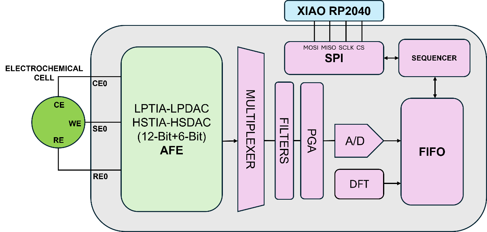
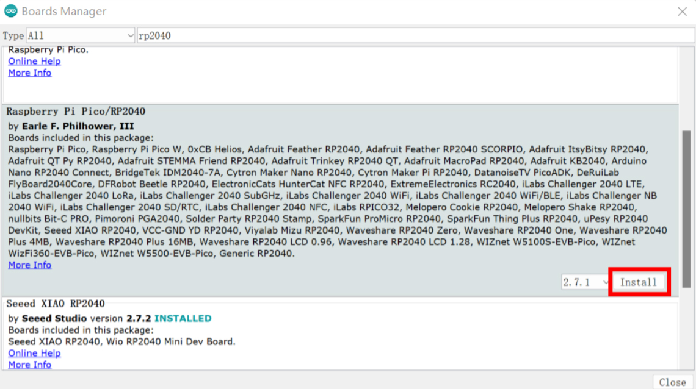
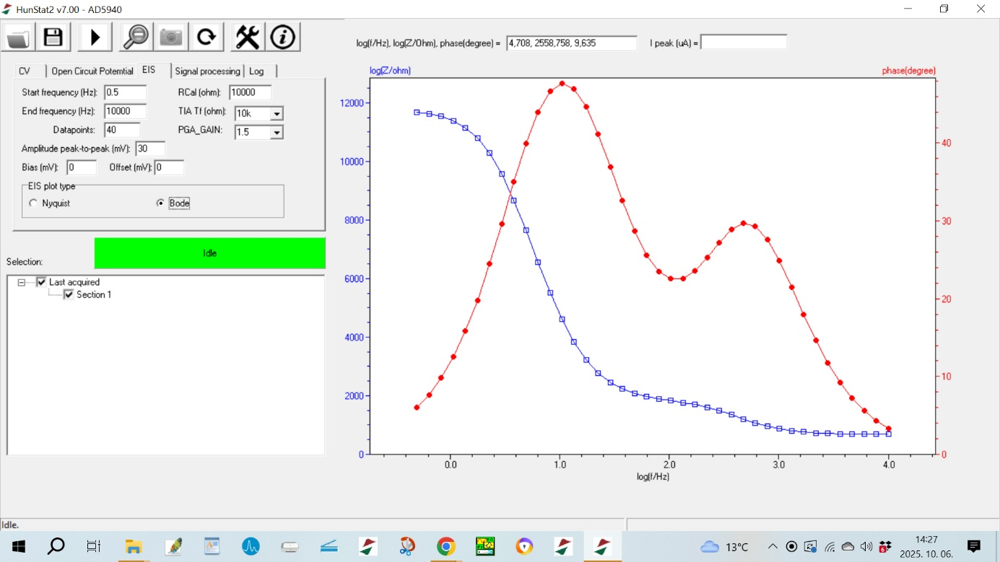
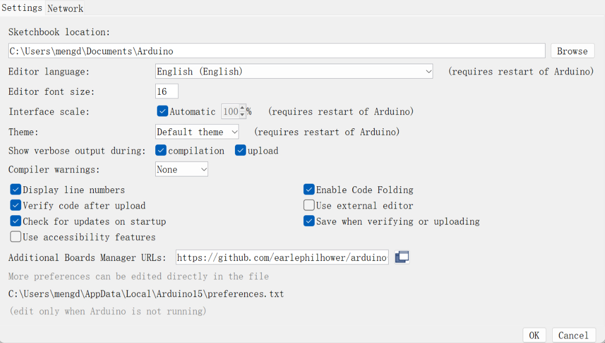
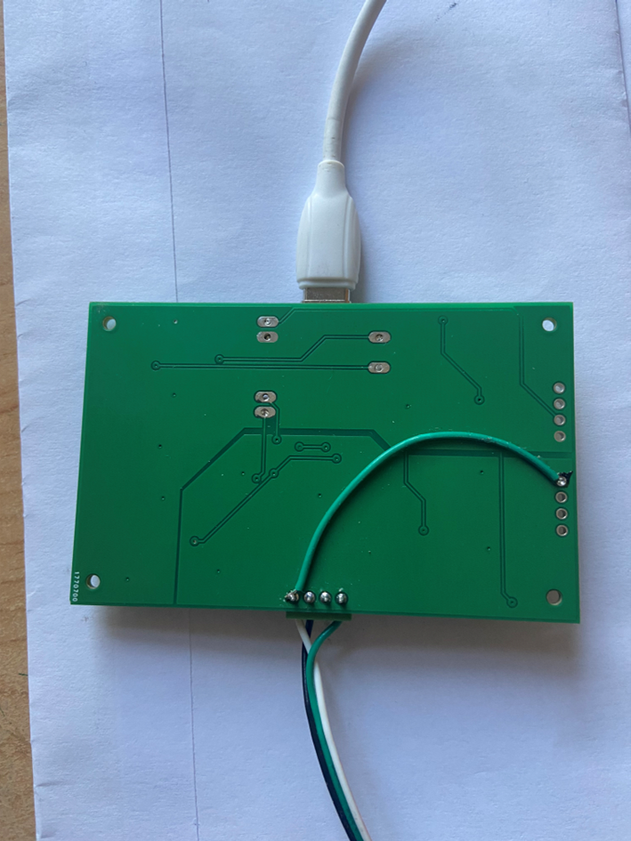
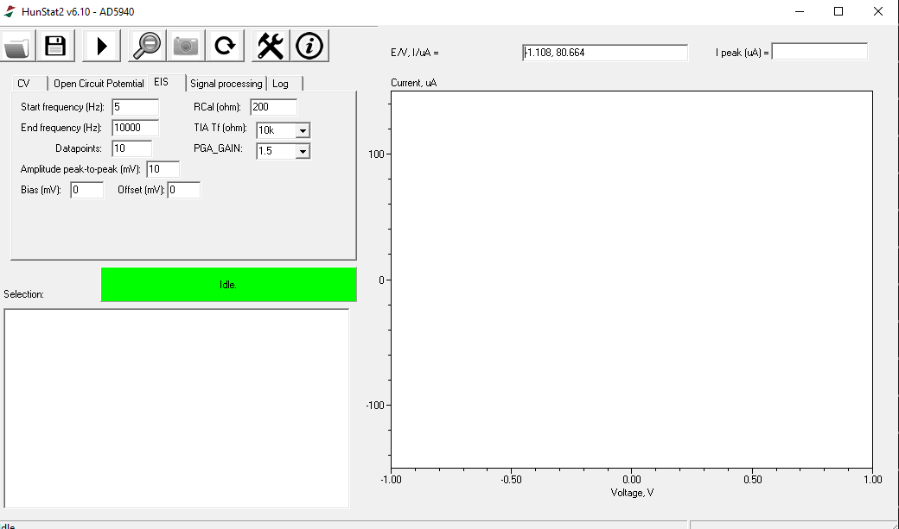
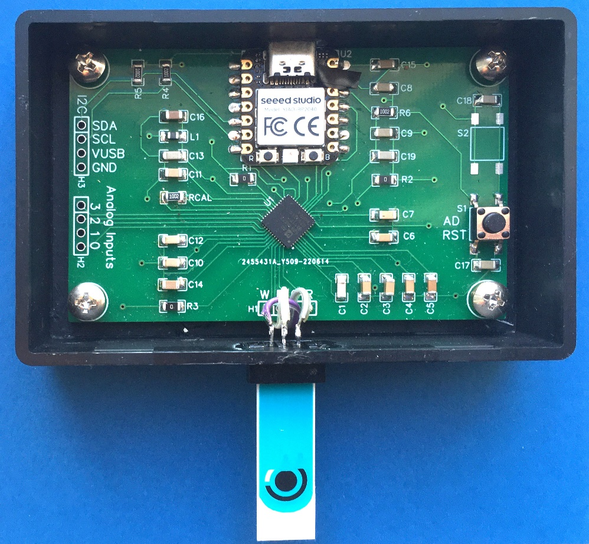
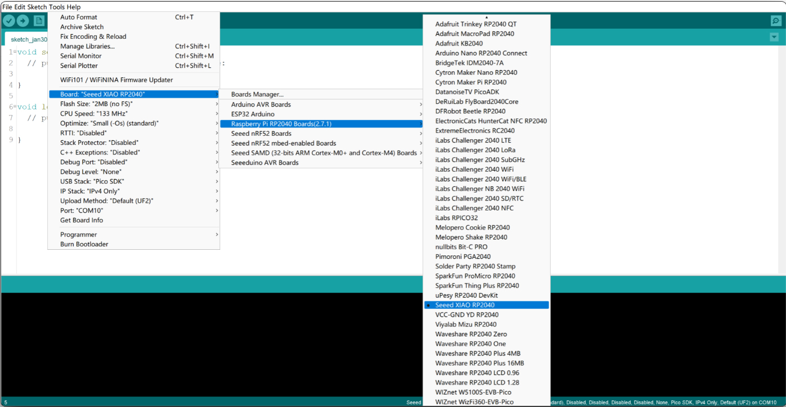
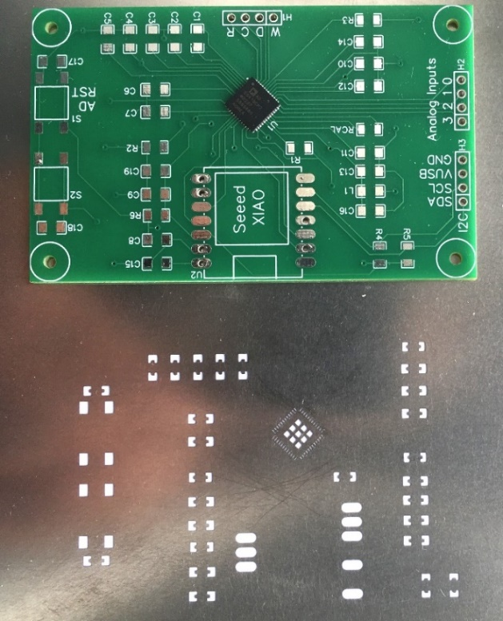
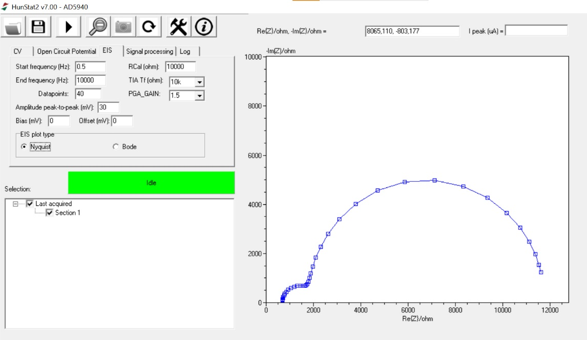

# SUPPORTING INFORMATION

## HunStat2 – a Simple and Low-Cost Potentiostat with Electrochemical Impedance Spectroscopy Capability

**Authors:**  
Istvan Vamosaa, Richard Morrisonb, Sandor Michaletzkyc, Vilmos Kerteszd*  

**Affiliations:**  
a. Lajos Petrik Vocational Chemistry School, Budapest, Hungary  
b. Retired Scientist, Melbourne, Australia  
c. Software developer, Budapest, Hungary  
d. Biosciences Division, Oak Ridge National Laboratory, Oak Ridge, TN, USA  

* **Corresponding Author:**  
Vilmos Kertesz  
Bioanalytical Mass Spectrometry Group  
Biosciences Division  
Oak Ridge National Laboratory, Oak Ridge, TN 37831-6131  
E-mail: [kerteszv@ornl.gov](mailto:kerteszv@ornl.gov)  
Phone: 865-574-3469  

---

This manuscript has been authored by UT-Battelle, LLC, under contract DE-AC05-00OR22725 with the US Department of Energy (DOE).  
The US government retains and the publisher, by accepting the article for publication, acknowledges that the US government retains a nonexclusive, paid-up, irrevocable, worldwide license to publish or reproduce the published form of this manuscript, or allow others to do so, for US government purposes.  
DOE will provide public access to these results of federally sponsored research in accordance with the [DOE Public Access Plan](https://www.energy.gov/downloads/doe-public-access-plan).

---

## S-3 Details on the AD5941 Chip

**Key components of the AD5941 chip :**

Figure S1

- **LPTIA (Low Power Transimpedance Amplifier):** Converts current to voltage.  
- **LPDAC (Low Power Digital-to-Analog Converter):** Generates VZERO and VBIAS.  
- **HSTIA (High-Speed Transimpedance Amplifier):** Converts high-bandwidth current signals up to 200 kHz into voltage for ADC measurement.  
- **HSDAC (High-Speed Digital-to-Analog Converter):** Generates high-frequency sinusoidal excitation signals.  
- **DFT (Discrete Fourier Transform) Engine:** Performs built-in Fourier transformation to compute the real and imaginary components of impedance.  
- **FIFO (First In, First Out) Buffer:** Temporarily stores measurement data to optimize communication with the microcontroller.  
- **SPI (Serial Peripheral Interface):** Provides data communication between the AD5941 and the microcontroller.

The AD5941 AFE includes essential components for voltammetric measurements: control amplifiers, transimpedance amplifiers (LPTIA), and DACs.  
The low-bandwidth AFE supports DC techniques, while the high-bandwidth AFE (capable of handling signals up to 200 kHz) is used for EIS.  
Key components include a high-speed DAC (HSDAC), a frequency generator, and a transimpedance amplifier (HSTIA).

The AD5941’s FIFO buffer temporarily stores measurement data for efficient transfer to a microcontroller, minimizing data loss.  
The chip’s programmable gain amplifier (PGA) adjusts signal levels before digitization.  
The potentiostat control is managed using a XIAO RP2040 microcontroller interfacing with the AD5941 via SPI.  
The XIAO RP2040 manages HunStat2’s operation, serving as the interface between the potentiostat and the PC-based data processing software.  
Communication is handled via USB, ensuring stable data transfer and providing power to the device.

SPI synchronizes data transfer between the microcontroller (Master) and the AD5941 (Slave) using dedicated lines:  
**MOSI** (Master Out, Slave In), **MISO** (Master In, Slave Out), **SCLK** (Clock), and **CS** (Chip Select).

The AD5941 supports amperometry, chronoamperometry, cyclic voltammetry, square wave voltammetry, and EIS.

---

## S-4 Details on the HunStat2 Hardware

The key circuit of the EIS potentiostat is the AD5941 chip.[1]  
The chip is a very small 7×7 mm, 48-pin lead frame chip scale package (LFCSP) integrated circuit.  
Soldering is possible with the help of a stencil ordered together with the printed circuit board (PCB), see Figures **S2a/S2b**.

The stencil is a very thin metal plate, on which cutouts are made at the surface-mount device (SMD) pad locations using a laser beam.  
First, tin paste is applied to the solder pads on the PCB through the stencil, then the components are placed on the panel and heated (using a heat gun or a reflow oven).  
The radiated heat melts the tin paste and the components solder in by themselves.

The PCB board can be ordered based on Gerber files accessible from the authors.  
A ready-made mounted circuit board can also be ordered, for which the authors provide the necessary Bill of Materials (BOM) and PCB file.

> **Important:** To measure OCP, the reference electrode must be connected to the AIN3 pin on the board as shown in Figure S3.

To ensure reproducibility and broaden accessibility, the complete device can also be obtained in an assembled form.  
This option is useful where manual assembly may be difficult due to stencil-based soldering or limited SMD experience.  
Gerber, Pick-and-Place, and BOM files are available in the accompanying GitHub repository for professional PCB workflows.

  
  

---

## S-5 Setup Seeeduino XIAO RP2040 in the Arduino IDE

1. Open the Arduino IDE and go to **File → Preferences**.  
   Add the following URL to *Additional Boards Manager URLs*:  

